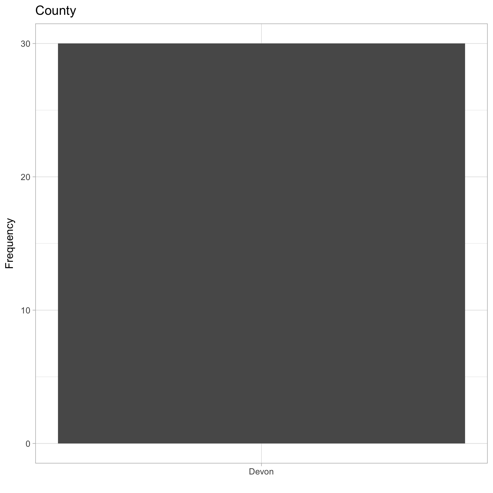
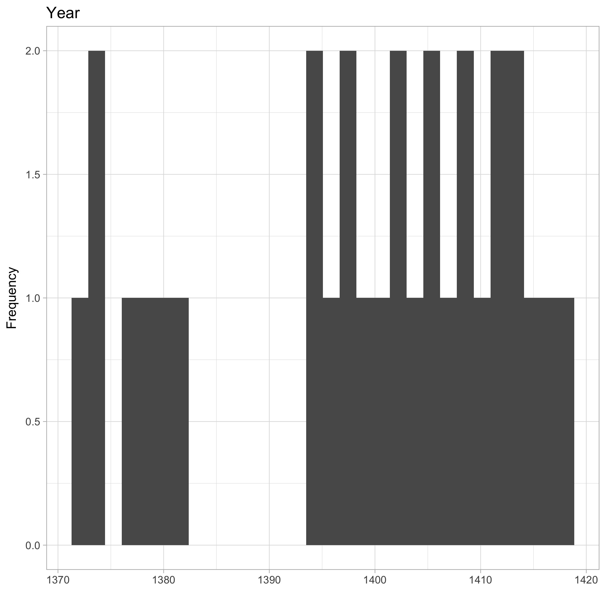
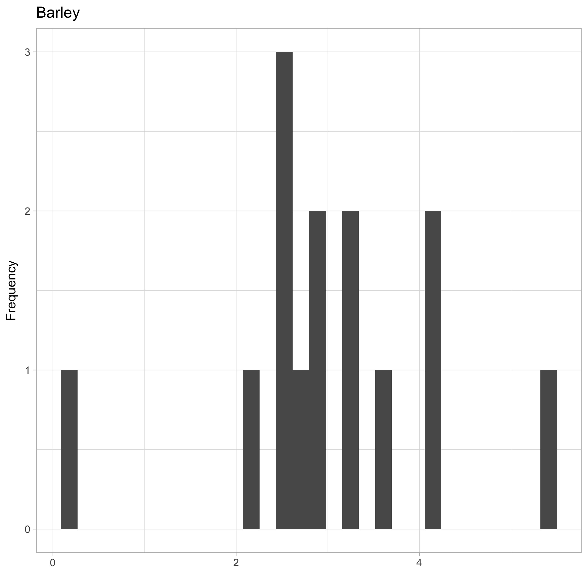
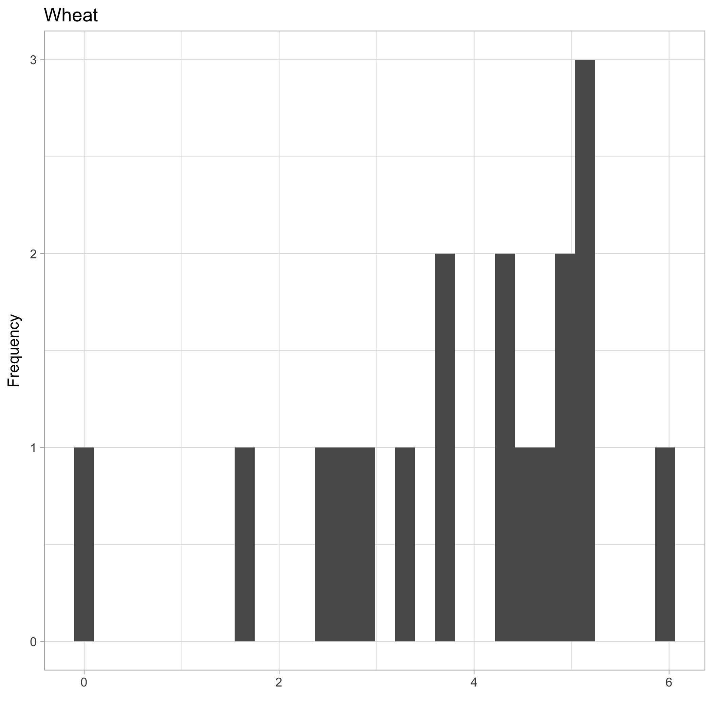

 
---
title: "Basic Example"
author: "Steph de Silva"
date: "`r Sys.Date()`"
output: rmarkdown::html_vignette
vignette: >
  %\VignetteIndexEntry{Vignette Title}
  %\VignetteEngine{knitr::rmarkdown}
  \usepackage[utf8]{inputenc}
---

excelTransition is designed as a series of 'training wheels' functions which allow you to create some outputs similar to those you'd already have created in Excel with a minimum amount of coding and time.

It's a package designed for you to use and abandon quickly. One of the most costly things about learning a new tool is the time you spend learning to do simple things you can already do in your current tool. excelTransition will help you produce some (very) basic analyses in minimum time, leaving you more time to work on learning R.

It's ideal for someone at the very beginning of their learning about programming. If you're an experienced programmer, you may not need these 'training wheels' at all.

# Let's start at the very beginning.

_Note: You only need to run the code in this section once. The next time you'd like to use this package or functions, pick up at the second step!_

This is a package designed for the very beginner, so let's start there. Lots of R code is stored in packages and you can use this code to build your own analyses. This is really useful, because you don't need to know _everything_ to do _something_. There are five packages used in this example. In order to get them, you need to download them from where they are hosted. Most of the packages you will use are hosted on CRAN. To download a package onto your local machine from CRAN, use these commands once. 

```{r, eval = FALSE, echo = TRUE}
install.packages("readxl")
install.packages("ggplot2")
install.packages("openxlsx")
install.packages("devtools")
```

The fifth package you'll be using is the excelTransition package. But as it's still in the design stages, it's not ready to be hosted on Cran. It's hosted on github currently. We can use the `devtools` package to get packages from github. Use the following code to do this:

```{r eval = FALSE, echo = TRUE}
devtools::install_github("stephdesilva/excelTransition")
```

Right! Now you've got all the packages you need.

# Step 2: Using the excelTransition package

Now that we have our packages, we need to install them. We do this using the `library` command.

```{r eval = FALSE, echo = TRUE}
library(readxl) 
        # readxl is the package which allows you to load Excel files in R
library(ggplot2) 
        # everybody likes charts, this is a great package to work with
library(openxlsx) 
        # a package for writing excel files

library(excelTransition) 
        # this is the package where the excelTransition functions live

```

# Loading data

When you're first starting out, data wrangling can be a challenge. The Ratesetter vignette goes through loading an excel spreadsheet full of data, but let's use a pre-wrangled R data frame for this simple example.

```{r eval = FALSE, echo = TRUE}

cropYields <- readRDS("../data/cropYields.RDS")
                      # this data is located in the excelTransitions package 
                      # so it's pre-loaded
```

## Where did this data come from?

This is the 14th century crop yield records from the Bishop of Exeter's Clyst in Devon, England. It covers rye, wheat and barley and was collated by Bruce Campbell. The full reference for this data is: 

Bruce M. S. Campbell (2007), Three centuries of English crops yields, 1211‑1491 [WWW document]. URL http://www.cropyields.ac.uk [11/11/2017]


# The makeDescriptives() function

You will be quite familiar with the Excel descriptive statistics function. The `makeDescriptives()` function in the excelTransitions package builds a very similar set of statistics for any dataframe you give it. You can access this by using this code:

```{r eval = FALSE, echo = TRUE}
 myResults <- makeDescriptives(cropYields) 
          # get the basic descriptives similar to Excel.
          # comes with a sheet offering some notes on interpretation
```

This function does two things: firstly, it produces a dataframe called myResults which gives things like the mean, median, standard deviation and so on like you would get in Excel. You can access this data frame from your global enironment - go take a look! However, often you will want to use this information with colleagues, who may excel users not keen on R just yet. That's OK. This function automatically writes an excel file to your working directory with these results and offers some notes on intepretation too.

# The makeCharts() function

Of course, no description of the data is complete without charts. So here's another function that will go through each column of your data frame and - where it can - build a simple histogram or bar chart for quick 'at a glance' starting-point analysis.

```{r eval = FALSE, echo = TRUE}

makeCharts(cropYields)
          #make charts on the cropYields data

```

These charts will be written as `.jpg` into your working directory for you to peruse at your leisure. Be cautious using this function: it will produce a chart for most of the columns in your data frame, if you run it again, it will produce a new set of charts, it won't overwrite the old ones. You could end up with alot of charts, very quickly. The Ratesetter vignette will show you how to deal with this.

Be aware that not every part of your data frame may generate a sensible chart! Take a look at this one from the crop yields data:

{width=400px}

This is a bar chart of the Counties covered by this data. There's only one. It's a bit of a useless chart.

And another useless chart:

{width=400px}

What does a histogram of a year tell us? Not a whole lot.

Bear in mind that this function is not _smart_. It doesn't know what you want, it's just a means of generating a bunch of charts quickly and with minimal code.

Here are some more useful ones.

{width=400px}

{width=400px}

These are genuinely useful because we can see the characteristics of this data set at a glance.

# Conclusion

The excelTransition package is just that: a transition helper. Make some useful things, quickly while you're learning. Then _don't use it any more_. You'll find you quickly don't need it as you learn about useful things like `ggplot` and `skmir` which can do these things better and with a greater degree of control for you, the analyst. 


